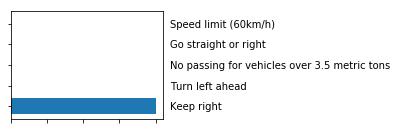

#**Traffic Sign Recognition** 

##Writeup Template

###You can use this file as a template for your writeup if you want to submit it as a markdown file, but feel free to use some other method and submit a pdf if you prefer.

---

**Build a Traffic Sign Recognition Project**

The goals / steps of this project are the following:
* Load the data set (see below for links to the project data set)
* Explore, summarize and visualize the data set
* Design, train and test a model architecture
* Use the model to make predictions on new images
* Analyze the softmax probabilities of the new images
* Summarize the results with a written report

[//]: # (Image References)

[image1]: ./examples/visualization.jpg "Visualization"
[image2]: ./examples/grayscale.jpg "Grayscaling"
[image3]: ./examples/random_noise.jpg "Random Noise"
[image4]: ./examples/placeholder.png "Traffic Sign 1"
[image5]: ./examples/placeholder.png "Traffic Sign 2"
[image6]: ./examples/placeholder.png "Traffic Sign 3"
[image7]: ./examples/placeholder.png "Traffic Sign 4"
[image8]: ./examples/placeholder.png "Traffic Sign 5"

## Rubric Points
###Here I will consider the [rubric points](https://review.udacity.com/#!/rubrics/481/view) individually and describe how I addressed each point in my implementation.  

---
###Writeup / README

####1. Provide a Writeup / README that includes all the rubric points and how you addressed each one. You can submit your writeup as markdown or pdf. You can use this template as a guide for writing the report. The submission includes the project code.

You're reading it! and here is a link to my [project code](https://github.com/udacity/CarND-Traffic-Sign-Classifier-Project/blob/master/Traffic_Sign_Classifier.ipynb)

###Data Set Summary & Exploration

####1. Provide a basic summary of the data set and identify where in your code the summary was done. In the code, the analysis should be done using python, numpy and/or pandas methods rather than hardcoding results manually.

The code for this step is contained in the second code cell of the IPython notebook.  

I used the pandas library to calculate summary statistics of the traffic
signs data set:

* The size of training set is 34799
* The size of test set is 12630
* The shape of a traffic sign image is (32, 32, 3)
* The number of unique classes/labels in the data set is 43

####2. Include an exploratory visualization of the dataset and identify where the code is in your code file.

The code for this step is contained in the third code cell of the IPython notebook.  

Here is an exploratory visualization of the data set.

###Design and Test a Model Architecture

####1. Describe how, and identify where in your code, you preprocessed the image data. What tecniques were chosen and why did you choose these techniques? Consider including images showing the output of each preprocessing technique. Pre-processing refers to techniques such as converting to grayscale, normalization, etc.

The code for this step is contained in the fourth code cell of the IPython notebook.

As a first step, I decided to convert the images to grayscale because color infomation not so helpful for classify image

Here is an example of a traffic sign image before and after grayscaling.

after that i normalization every image form 0 - 255 to 0 - 1, because if the input value size is too big or too small, it will effect the loss function when training the model

####2. Describe how, and identify where in your code, you set up training, validation and testing data. How much data was in each set? Explain what techniques were used to split the data into these sets. (OPTIONAL: As described in the "Stand Out Suggestions" part of the rubric, if you generated additional data for training, describe why you decided to generate additional data, how you generated the data, identify where in your code, and provide example images of the additional data)
Code is In the six IPython cell 
i use train_test_split function form sk-learn package for split my X_train data to training data and validation data, the size of training data size is 27839, and the validation data size is 6960
then i train my model

####3. Describe, and identify where in your code, what your final model architecture looks like including model type, layers, layer sizes, connectivity, etc.) Consider including a diagram and/or table describing the final model.

The code for my final model is located in the seventh cell of the ipython notebook. 

My final model consisted of the following layers:

| Layer         		|     Description	        					| 
|:---------------------:|:---------------------------------------------:| 
| Input         		| 32x32x1 image   							| 
| Convolution 5x5     	| 1x1 stride, valid padding, outputs 28x28x6	|
| RELU					|												|
| Max pooling	      	| 2x2 stride,  valid padding, outputs 14x14x6 				|
| Convolution 5x5	    |    1x1 stride,  valid padding, outputs 10x10x16									|
| RELU		|        									|
| Max pooling				| 2x2 stride,  valid padding, outputs 5x5x16       									|
|	flatten					|	output 400									|
|		Fully Connected				|	output 120		
|		RELU				|	
|		Fully Connected				|	output 84
|		RELU				|	
|		Fully Connected				|	output 43								|
 

####4. Describe how, and identify where in your code, you trained your model. The discussion can include the type of optimizer, the batch size, number of epochs and any hyperparameters such as learning rate.

The code for training the model is located in the 6th and 7th cell of the ipython notebook. 

To train the model, I used learning rate is 0.001, EPOCHS is 30, BATCH_SIZE is 128, i choose Adam as my Optimizer, after each epoch, i use evaluate calculate the accuracy, after 30 epoch, the accuracy is 98% on the validation data

####5. Describe the approach taken for finding a solution. Include in the discussion the results on the training, validation and test sets and where in the code these were calculated. Your approach may have been an iterative process, in which case, outline the steps you took to get to the final solution and why you chose those steps. Perhaps your solution involved an already well known implementation or architecture. In this case, discuss why you think the architecture is suitable for the current problem.

The code for calculating the accuracy of the model is located in the sixth and ninth cell of the Ipython notebook.

My final model results were:
* training set accuracy of 0.997
* validation set accuracy of 0.979
* test set accuracy of 0.887

If a well known architecture was chosen:
* What architecture was chosen?
  LeNet
* Why did you believe it would be relevant to the traffic sign application?
  Lenet is good at image classify, so i choose it
* How does the final model's accuracy on the training, validation and test set provide evidence that the model is working well?
  training set accuracy of 0.997
  validation set accuracy of 0.979
  test set accuracy of 0.887

###Test a Model on New Images

####1. Choose five German traffic signs found on the web and provide them in the report. For each image, discuss what quality or qualities might be difficult to classify.

Here are five German traffic signs that I found on the web:

they are easy for classify, because the background of image is clean

####2. Discuss the model's predictions on these new traffic signs and compare the results to predicting on the test set. Identify where in your code predictions were made. At a minimum, discuss what the predictions were, the accuracy on these new predictions, and compare the accuracy to the accuracy on the test set (OPTIONAL: Discuss the results in more detail as described in the "Stand Out Suggestions" part of the rubric).

The code for making predictions on my final model is located in the 9th cell of the Ipython notebook.

Here are the results of the prediction:

| Image			        |     Prediction	        					| 
|:---------------------:|:---------------------------------------------:| 
| Wild animals crossing      		| Wild animals crossing  									| 
| No entry     			| No entry									|
| Keep right					| Keep right											|
| Yield	      		| Yield				 				|
| Road work			| Road work     							|

The model was able to correctly guess all traffic signs, which gives an accuracy of 100%. This compares favorably to the accuracy on the test set of 88.7%

####3. Describe how certain the model is when predicting on each of the five new images by looking at the softmax probabilities for each prediction and identify where in your code softmax probabilities were outputted. Provide the top 5 softmax probabilities for each image along with the sign type of each probability. (OPTIONAL: as described in the "Stand Out Suggestions" part of the rubric, visualizations can also be provided such as bar charts)

The code for making predictions on my final model is located in the 11th cell of the Ipython notebook.

For the first image, the model is relatively sure that this is a Wild animals crossing sign (probability of 9.99945760e-01), and the image does contain a Wild animals crossing sign. The top five soft max probabilities were

| Probability         	|     Prediction	        					| 
|:---------------------:|:---------------------------------------------:| 
| 9.99945760e-01          			| Wild animals crossing									| 
| 5.42179187e-05  				| Double curve										|
| 1.56280535e-08				| Road work										|
| 8.91035455e-13     			| Speed limit (50km/h)				 				|
| 8.35183634e-15					    | Dangerous curve to the left    							|

For the second image ... 

For the third image ... 

For the fourth image ... 

For the five image ... 

